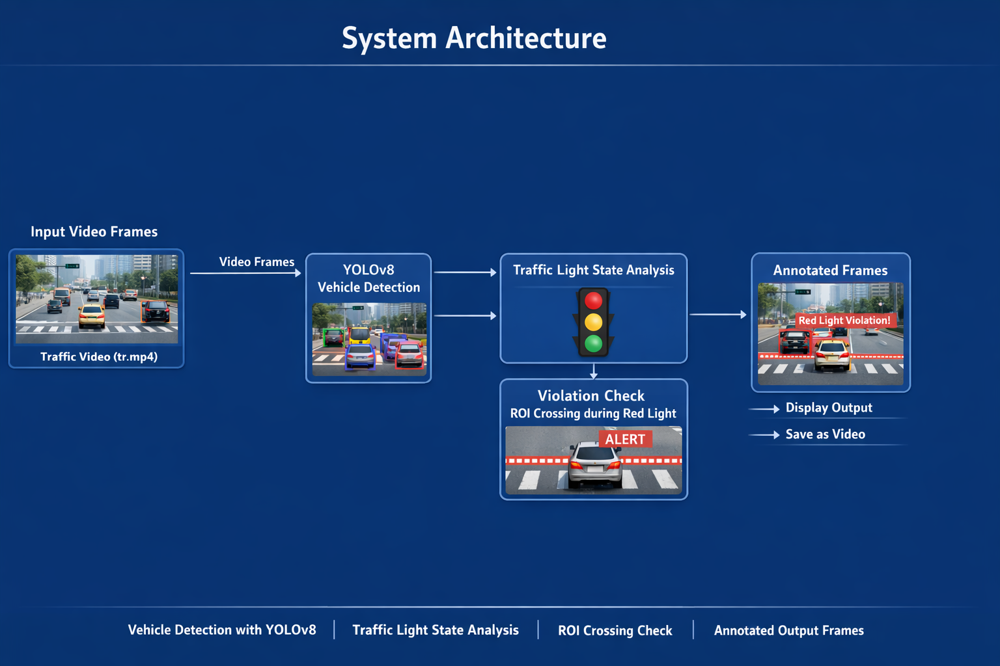
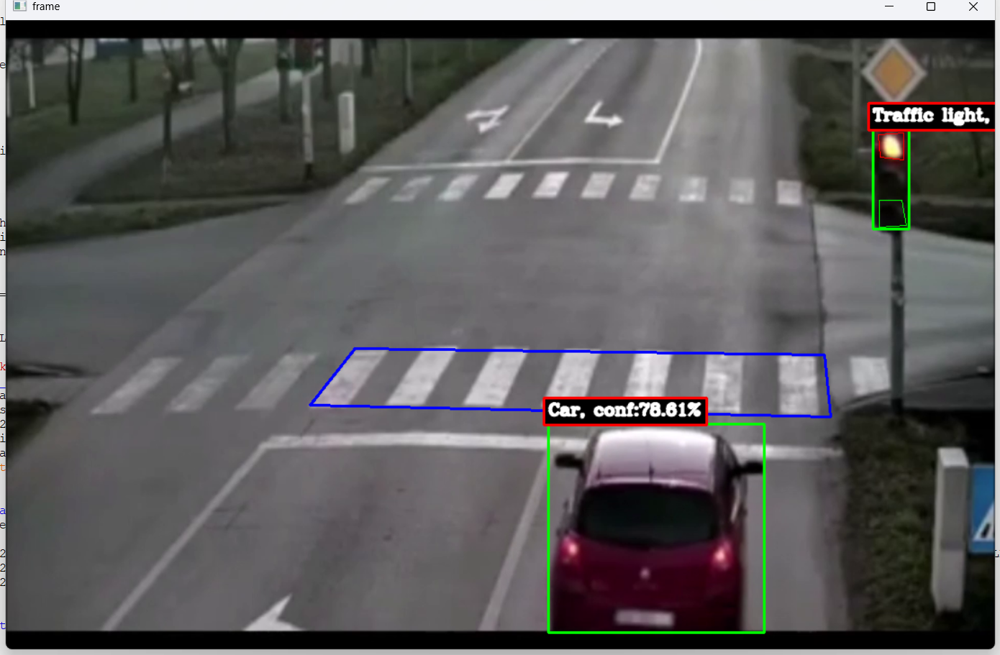
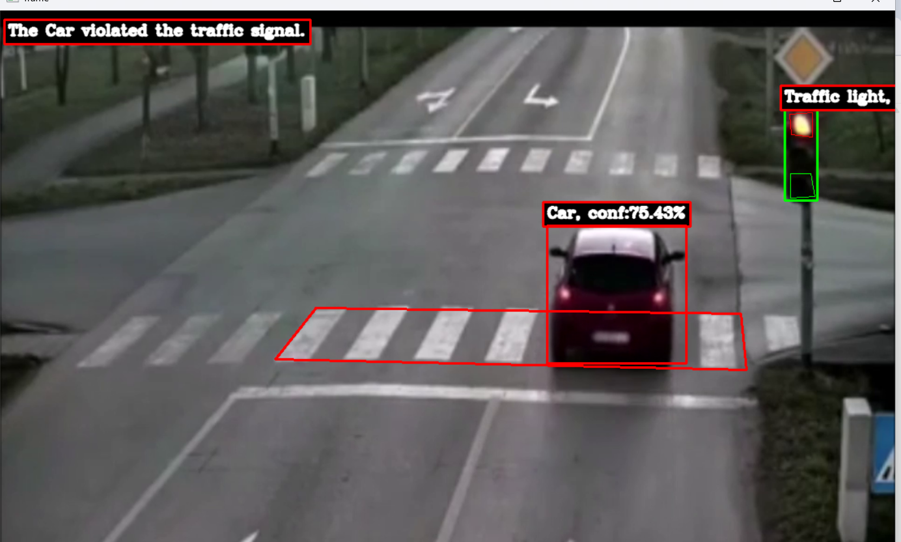

# Traffic Signal Violation Detection System

##  Overview
This project is an **AI-based Traffic Signal Violation Detection System** that uses the **YOLOv8 object detection model** and **OpenCV** to detect vehicles violating traffic signals in real-time.  
The system monitors traffic lights, identifies active red lights, and flags vehicles that cross a designated **Region of Interest (ROI)** during a red signal.

It is designed for **smart traffic monitoring, automated law enforcement, and intelligent transportation systems**.

---

##  Features

- Real-time Object Detection  
- Traffic Light Monitoring
- Violation Detection
- Visual Feedback
- Configurable Confidence Threshold
---

**Explanation of Workflow:**

- **Video Capture**: The system reads traffic video frame by frame.  
- **Traffic Light Detection**: By analyzing the ROI for red light color intensity.  
- **Vehicle Detection**: YOLOv8 identifies all vehicles in the frame.  
- **Violation Logic**: A polygon ROI is defined; any vehicle crossing it while red light is on is flagged.  
- **Visualization**: Bounding boxes, text, and ROI polygon are drawn on frames.  
- **Output**: Can be saved as processed video or visualized live.

---

##  System Architecture

  

---

##  Demo Video

Download or watch the demo video here:  
[tr.mp4 Demo Video](https://drive.google.com/file/d/1jLGp96o1oMsi7MxVHpQLEMnpvxY-LXsg/view?usp=drive_link)

---

##  YOLOv8 Model Weights

Download the YOLOv8 model here:  
[yolov8m.pt Model](https://drive.google.com/file/d/1l_n8OrFfarn2qHrWAD_3NmXb6L53GBmB/view?usp=drive_link)

---

##  Sample Output

  
  
---

##  Requirements

Install Python dependencies using:

```bash
pip install -r requirements.txt

